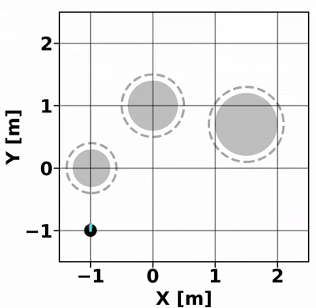
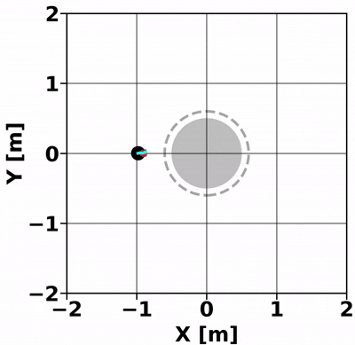

# CSC-MPPI: A Novel Constrained MPPI Framework with DBSCAN for Reliable Obstacle Avoidance

This repository provides a **PyTorch-accelerated implementation** of the **Constrained Sampling Cluster MPPI (CSC-MPPI)** algorithm.

CSC-MPPI introduces a novel constrained sampling framework based on **DBSCAN clustering** and **primal-dual gradient optimization** to improve obstacle avoidance and constraint satisfaction in sampling-based Model Predictive Path Integral (MPPI) control.

The algorithm is designed for high-performance execution on GPU using **PyTorch with efficient tensor operations**, enabling fast and parallelized trajectory rollouts.

---

## 📰 Publication

**📄 Title:** *CSC-MPPI: A Novel Constrained MPPI Framework with DBSCAN for Reliable Obstacle Avoidance*  
**🛠 Authors:** Leesai Park¹, Keunwoo Jang²†, and Sanghyun Kim¹³†  
**📅 Conference:** IEEE/RSJ International Conference on Intelligent Robots and Systems (**IROS**) 2025  
- 🔗 **Project Website**: [https://cscmppi.github.io/](https://cscmppi.github.io/)
- 📹 **YouTube Video**: [Watch Video](https://www.youtube.com/watch?v=NM2Q5UQGleM&feature=youtu.be)
---

## ⚙️ Prerequisites

- Python 3.10+
- Pytorch with GPU support
- CUDA 11.8+
- Recommended: Use a virtual environment (e.g., conda)

### ✅ Create Virtual Environment


```bash
conda create -n csc_mppi python=3.10
conda activate csc_mppi

conda install matplotlib
conda install pytorch=2.5.1 torchvision pytorch-cuda=11.8 -c pytorch -c nvidia
conda install -c rapidsai -c nvidia -c conda-forge -c defaults cuml python=3.10 cudatoolkit=11.8

```

---

## 🚀 Installation and Run

```bash
git clone <repository_url>
cd <repository_name>
python3 main/env1.py or main/env2.py
```

---

## 🎬 Experiment Results

### Environment 1

| CSC-MPPI | Standard MPPI |
|---------------|----------|
|  |  |

---

### Environment 2

| CSC-MPPI | CSC-MPPI wo DBSCAN |
|---------------|----------|
|  |  |

---
